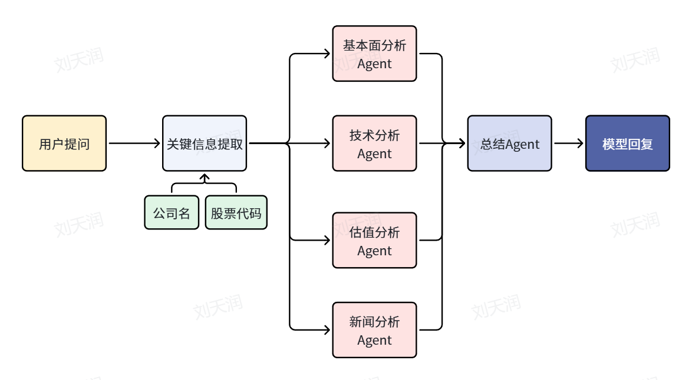

这是一个基于 LangGraph 的金融分析 Agent 系统，用于分析 A 股股票。参考了 GitHub 上的开源项目[ai-hedge-fund](https://github.com/virattt/ai-hedge-fund)

系统包含五个 Agent：基本面分析 Agent、技术分析Agent、估值分析 Agent、新闻分析 Agent 和总结 Agent。前四个 Agent 通过 MCP 工具获取 A 股相关数据并与大语言模型（LLM）交互；总结 Agent 综合上游数据，提供最终投资建议。



## 项目运行
1. 安装依赖
```bash
export PYTHONPATH=./                   #把当前目录加入 Python 的包搜索路径
pip install -r requirements.txt
```
2. 设置API
项目支持两种模式：API 调用大模型和本地FinR1模型。
目前只有Summary Agent可以使用本地 FinR1，其余4个Agent仍然依赖API调用大模型，所以无论哪种模式，都必须配置 API_KEY。

USE_LOCAL_MODEL=api表示使用api调用大模型，如果想使用FinR1，请设置为USE_LOCAL_MODEL=local，并自行下载https://huggingface.co/SUFE-AIFLM-Lab/Fin-R1模型（大小为7B）。

```bash
cd Financial-MCP-Agent/                         
OPENAI_COMPATIBLE_API_KEY=your_api_key
OPENAI_COMPATIBLE_BASE_URL=your_base_url
OPENAI_COMPATIBLE_MODEL=your_model
USE_LOCAL_MODEL=api 
```

3. 配置MCP服务器路径
修改Financial-MCP-Agent/src/tools/mcp_config.py
SERVER_CONFIGS = {
    "a_share_mcp_v2": {  
        "command": "uv", 
        "args": [
            "run",  
            "--directory",
            r"/root/autodl-tmp/Finance/a-share-mcp-is-just-i-need",  # 修改为a-share-mcp-is-just-i-need项目（即MCP服务器）的路径
            "python",  
            "mcp_server.py"  # MCP服务器脚本
        ],
        "transport": "stdio",
    }
}

4. lora微调得到风险分析模型和情感分析模型
在本步骤中，需要使用大语言模型（默认Qwen3-8B）和指定的数据集来训练两个模型：
- 风险分析模型（测试代码在test_qwen_risk.py）
- 情感分析模型（测试代码在test_qwen_sentiment.py）
这两个模型都将在后面的新闻分析Agent中使用。

数据集可以直接使用 HuggingFace 上的两个现成的：
- 风险分析数据集：https://huggingface.co/datasets/benstaf/risk_nasdaq
- 情感分析数据集：https://huggingface.co/datasets/benstaf/nasdaq_news_sentiment

5. 测试mcp工具功能
```bash
cd a-share-mcp-is-just-i-need
pip install baostock
python test_baostock.py
```

6. 测试agent功能
用户query参考详见/Financial-MCP-Agent/test_extraction.py。生成的markdown报告在Financial-MCP-Agent/reports中。
cd ../Financial-MCP-Agent
python src/main.py --command "帮我看看茅台(600519)这只股票值得投资吗"